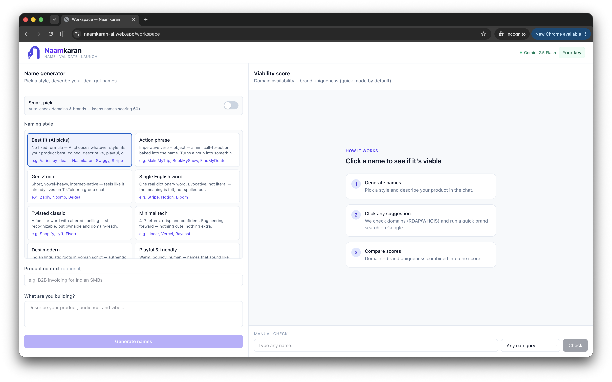
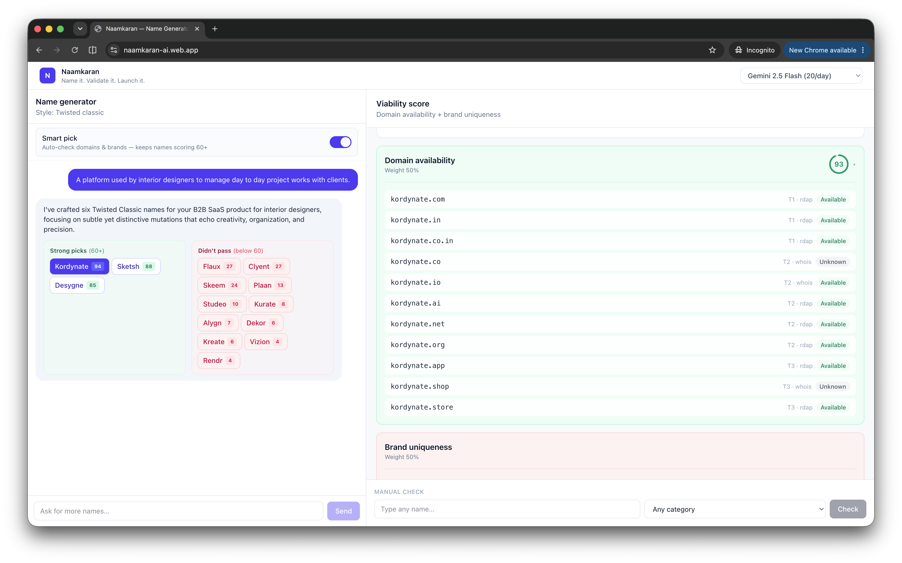

# Naamkaran

Turborepo monorepo for the name viability checker (`naamkaran-407d7`).

**Live:** [naamkaran-ai.web.app](https://naamkaran-ai.web.app) · **Blog:** [I got tired of falling in love with product names that were already taken — so I built Naamkaran](https://dev.to/neetigyachahar/i-got-tired-of-falling-in-love-with-product-names-that-were-already-taken-so-i-built-naamkaran-3gmk)

## Screenshots

**Workspace** — generate names and run viability checks side by side.



**Smart pick** — generate and validate names in one flow.



## Apps

- `apps/web` — React Router (static SPA) hosted on Firebase Hosting
- `apps/functions` — Firebase Cloud Functions (TypeScript) with `analyzeName` callable
- `packages/shared` — Zod schemas shared between web and functions

## Getting started

```bash
bun install
bun run build
```

### Environment

**Functions** (Firebase Secret Manager):

```bash
firebase functions:secrets:set GOOGLE_AI_STUDIO_KEY
# Only needed when registration checks are enabled:
firebase functions:secrets:set DATA_GOV_IN_API_KEY
```

**Web** — copy `apps/web/.env.example` to `apps/web/.env` and fill in Firebase config from the console.

For local emulators, set `VITE_USE_FIREBASE_EMULATOR=true`.

## Development

```bash
# Terminal 1: Firebase emulators (functions + hosting)
bun run emulators

# Terminal 2: Web dev server
bun run dev --filter=web
```

## Deploy

```bash
bun run deploy
```

## Architecture

`analyzeName` runs checks in parallel:

1. **Domain** — RDAP (IANA bootstrap) with WHOIS fallback
2. **Brand uniqueness** — Gemini 2.5 Flash with Google Search grounding (multi-angle search)

Composite score: domain 50% + brand 50%.

**Registration checks** (MCA / trademark) are implemented but disabled via `REGISTRATION_CHECK_ENABLED` in `apps/functions/src/config/features.ts`. Flip to `true` when ready.
